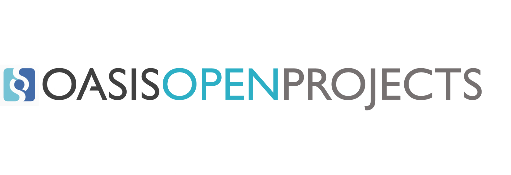

| <h1>PublicCode.yml Charter</h1> | |
|------------------------|--- |
| **1. Project Name**   |   |
| ***1.1 Full Name***     | PublicCode.yml |
| ***1.2 Familiar Name*** | PublicCode-community |
| **2. Abstract**   |  The objective of the PublicCode.yml Open Project is to develop the file format for describing public software, create awareness and educate the world about the benefits of using open source software in public administrations. The group will maintain the file format and keep it aligned with the needs of the governments and the agencies. |
| **3. Purpose and Scope**  | Public code is becoming more and more relevant each day, however its discoverability is crucial in order to effectively reuse it also in contexts different from the ones where it was originated. As such, creating catalogues where public code is indexed and easily searchable is key to stimulate its reuse. However, catalogues need to be populated in an automated way to avoid scalability issues and to quickly grow. The publiccode.yml format goes exactly in this direction. In fact, it is a file that has to be stored in the root of the repository of the open source software in question containing the metadata definition of such software. In this way, it is quite trivial for automated algorithms, such as a crawler, to look for the file, extract relevant information from it, create a HTML page dedicated to that software and then insert such page in the catalogue.  Below this table is an initial list of activities and materials which may be developed by the publiccode.yml Open Project working group.|
| **4. Business Benefits**   | Government bodies and agencies are starting to adopt free and open source software thanks to a set of federal and national policies. As such, there is a strong need to clearly define a metadata specification standard to make such software easy indexable and eventually discoverable. The Publiccode.yml Open Project will also focus on studying the economic impact of the standard and how its introduction will affect the discoverabily and reusability process.
| **5. Relationship to Other Projects**  | None|
| **6. Repositories and Licenses** | The Github organization named [publiccode.yml](https://github.com/publiccodeyml) will contain the publiccode.yml file, its documentation together with a set of tools needed to further work on the standard. The license is CC0. |
| **7. Initial Contributions from Existing Work**  | The initial version of the publiccode.yml specification has been initiated, curated and it is currently maintained by the Italian Digital Transformation Team of the Italian Government. The team is currently: <ul><li>Riccardo Iaconelli (no longer part of the Digital Transformation Team)</li><li>Leonardo Favario</li><li>Andrea Biancini</li><li>Alessandro Ranellucci</li></ul>. [This](https://github.com/italia/publiccode.yml) is the current repository. Other contributors to the project: |

The following is an initial list of activities and materials which may be developed by the publiccode.yml Open Project working group.  
<ol>
    <li>**Standard Development
        <ol>
            <li>Definition of the main international keys</li>
            <li>Definition of recognized rules for Country customization</li>
            <li>Definition and development of working reference materials</li>
    <li>**Tools**
        <ol>
            <li>Definition of a set of working tools</li>
            <li>Development of a set of tools</li>
    <li>**Awareness**
        <ol>
            <li>Dedicated Website</li>
            <li>Media Outreach Campaign</li>
            <li>Publiccode Conference</li>
            <li>Publiccode Hackathon</li>
        </ol>
    </li>
    <li>**Education**
        <ol>
            <li>What is public code and why we need it?</li>
            <li>Relationship between public code and open source licenses</li>
            <li>Importance of having a standard for public code</li>
            <li>Advantages of the standard</li>
            <li>Public code in governments</li>
        </ol>
    </li>
    <li>**Marketing**
        <ol>
            <li>Impact of public code in an open government perspective</li>
            <li>Societal impact of public code reuse</li>
            <li>Standards & Innovation</li>
        </ol>
    </li>
</ol>
